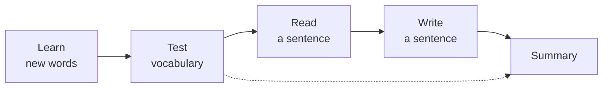

# Vocabulary testing and spaced repetition in HanLearn

This document describes how HanLearn tests vocabulary and how it schedules the
next review of each word. It covers the review session, the scoring rule, and
the interval table. The last section lists the properties of this design for a
review against other retention methods.

## 1. What the app stores for each word

Every word in the list of a user is one document under
`users/{userId}/userWords/{wordId}`. The fields that control retention are:

| Field | Type | Purpose |
| --- | --- | --- |
| `bank` | 1 to 5 | The level of the word. The client calls this `level`. |
| `dueDate` | Timestamp | The date of the next review. |
| `listId` | string | The word list that holds the word. |
| `wordData` | object | The characters, the pinyin, and the meaning. |

There is one level and one due date for each word. There is no separate record
for each direction of recall. There is no ease factor, no lapse count, and no
history of past answers. The full state of the algorithm is two fields.

A new word starts at level 1. The due date of a new word is today, but it is
tomorrow when the list already holds more than 9 words. This rule limits the
size of the first session of a new user
(`web-client/src/services/wordService.ts`, `addWordToList`).

## 2. The shape of a session

A session has up to five stages. The stage machine is in
`web-client/src/containers/TestWords/TestWords.tsx`.



- **Learn** shows each word of level 1 with its decomposition into components.
  The stage has no scoring.
- **Test** is the vocabulary quiz. This stage is the only one that changes a
  level or a due date.
- **Read** and **Write** use example sentences from Gemini. These stages start
  only for the words that got a perfect score in the Test stage.
- **Summary** shows a strength label for each word of the session.

The user can disable the Learn, Read, and Write stages. The Test stage is
always present.

## 3. How the app selects the words for a session

`chooseTestSet` in `web-client/src/components/Test/Logic/TestLogic.ts:66` makes
the selection. The default size of a session is 5 words, and the user can
change this number in the settings.

1. The function keeps the words with a due date of today or earlier.
2. If the number of due words is not more than the session size, it returns
   all of them.
3. If there are more due words, it sorts them with the oldest due date first.
4. It takes the oldest words in full. For the words that share the due date at
   the cut-off, it shuffles the group and takes the remainder.

The shuffle uses a seed that comes from the date of today. As a result, the
same words appear in every session on the same day. The selection changes on
the next day. The overdue words always come before the words that are due
today.

Practice mode ignores the due dates and selects random words. Practice mode
does not write levels or due dates.

## 4. How the app builds the questions

For each word, the app builds a fixed set of question and answer pairs. Each
pair is a permutation of two categories: `C` for the character, `P` for the
pinyin, and `M` for the meaning. `setPermList` in `TestLogic.ts:110` builds the
list. The first letter is the answer and the second letter is the question.

| Permutation | The app shows | The user gives |
| --- | --- | --- |
| `PC` | the character | the pinyin |
| `PM` | the meaning | the pinyin |
| `MP` | the pinyin | the meaning |
| `MC` | the character | the meaning |
| `CM` | the meaning | the character, by handwriting |

A session with handwriting enabled has 5 questions for each word. A session
without handwriting has 4. A session of 5 words with handwriting therefore has
25 questions.

`assignQA` picks the next question at random from the questions that remain.
The user can name one permutation as a priority. The app then prefers that
permutation. A second setting removes all other permutations from the session.

The session ends when no question remains. A question leaves the list only
after a correct answer. The user therefore answers every question of every word
correctly before the session ends.

## 5. How the app marks an answer

The answer mode depends on the category of the answer. The user selects the
mode for the meaning and for the pinyin independently
(`web-client/src/utils/audioSettings.ts`).

**Input mode.** The user types the answer, or speaks it and the speech goes
into the same input. `checkAnswer` in
`web-client/src/components/Test/useTestEngine.ts` removes the punctuation,
lowers the case, and compares the strings.

- For the pinyin, it also removes the spaces and the neutral tone marker `5`.
  The comparison is exact after this step. A wrong tone is a wrong answer.
- For the meaning, the app splits the dictionary entry into separate meanings.
  A match with any one of them is correct.
- When the pinyin is correct except for the tones, the app answers
  `Incorrect tones` instead of `Try again`.

**Flashcard mode.** The user reveals the answer and then declares a correct or
a wrong recall. This mode is self-marked.

**Handwriting mode.** The `CM` permutation uses HanziWriter. The user draws
each character stroke by stroke. The component shows a hint after 5 wrong
strokes. A character that the user completes counts as correct.

A wrong answer in input mode has no effect on the score. The app plays a sound,
leaves the text in the input for an edit, and asks the same question again. The
user can retry without a limit.

## 6. How a score becomes a level

The app counts one miss for a word when the user presses **I Don't Know**,
selects the wrong recall on a flashcard, or gives up on a handwriting question.
Each miss appends the character of the word to `idkList`.

At the end of the Test stage, `onFinishTest` counts the misses for each word
and limits the count to 4. The score is `4 - misses`.

| Misses | Score | Label in the summary |
| --- | --- | --- |
| 0 | 4 | Very Strong |
| 1 | 3 | Strong |
| 2 | 2 | Average |
| 3 | 1 | Weak |
| 4 or more | 0 | Very Weak |

`finishTest` in `web-client/src/services/wordService.ts:285` writes the result:

```ts
if (score === 4 && level < 5) {
  level += 1;
} else if (score < 4) {
  level = 1;
}
```

The rule is all or nothing. A word moves up one level when the user answers
every question of that word without a request for the answer. One miss on one
question of the word returns the word to level 1.

## 7. The interval table

The new due date is the date of today plus the interval of the new level.

| Level | Interval |
| --- | --- |
| 1 | 1 day |
| 2 | 3 days |
| 3 | 7 days |
| 4 | 30 days |
| 5 | 60 days |

Level 5 is the top level. A word at level 5 with a perfect score stays at
level 5 and returns in 60 days. The shortest path from a new word to level 5 is
4 perfect sessions across 40 days: day 0, day 3, day 10, and day 40.

The intervals are absolute. The app measures them from the date of the session,
not from the date that was due. A late review therefore does not extend the
next interval.

The write is one Firestore batch. The app then reads the word list again, and
it increments the completion count of today in
`users/{userId}/testCompletions/{YYYY-MM-DD}`. The dashboard uses this
subcollection for the streak and for the statistics of the last 7 days.

## 8. The sentence stages

A word enters the Read and Write stages when the score of the word is 4 and the
level of the word is 1. A setting extends the stages to all words of the
session. The stages give production practice for the words that the user
recalls correctly.

- **Read** shows an example sentence that contains the word. The stage gives
  audio and a tap for the meaning of each token.
- **Write** asks the user for a sentence. `getSimilarityScore` in
  `web-client/src/services/similarityService.ts` sends the sentence of the user
  and the reference sentence to Gemini. Gemini returns a score from 0 to 100.

The similarity score is for the display only. It does not change a level or a
due date.

## 9. Properties of this design

This section is for the comparison against other retention methods.

**The unit of scheduling is the word, not the direction of recall.** Most
spaced repetition systems schedule each direction separately, because
recognition of a character is easier than production of it. HanLearn holds one
level for the word and tests all 4 or 5 directions in the same session. The
level therefore measures the weakest direction.

**Promotion needs a perfect session.** The step from level 4 to level 5 needs 5
correct answers in one session, and it needs them without one request for the
answer. The probability of promotion falls as the number of directions goes up.

**A miss is a full reset.** There is no partial step back, and there is no ease
factor that remembers a difficult word. A word that the user knows well but
misses once returns to a 1-day interval from a 60-day interval.

**Only a request for the answer counts as a miss.** A wrong typed answer costs
the user another attempt, but it does not change the score. A user who guesses
until the answer is correct keeps a perfect score. The score is therefore a
measure of confidence, not a measure of accuracy.

**The session always ends in success.** The app repeats a question until the
answer is correct. Each session therefore ends with a correct recall of every
word. This is the same idea as a relearning step, but the app applies it to
every word of every session.

**The intervals are fixed and short.** The maximum interval is 60 days. SM-2
systems grow the interval without a limit, and they reach years for a mature
card. A HanLearn word at level 5 returns about 6 times per year for as long as
the user keeps the word.

**There is no response time and no grade of difficulty.** The app records one
binary outcome for each question, and it does not use the time of the answer.

**The schedule is client-side.** `finishTest` runs in the browser and writes
the levels directly. The Cloud Functions do not participate in the schedule.

## 10. Where the code is

| Concern | File |
| --- | --- |
| Interval table, level update, due dates | `web-client/src/services/wordService.ts` |
| Word selection, question permutations | `web-client/src/components/Test/Logic/TestLogic.ts` |
| Session state, answer marking, misses | `web-client/src/components/Test/useTestEngine.ts` |
| Stage machine | `web-client/src/containers/TestWords/TestWords.tsx` |
| Streak and weekly statistics | `web-client/src/services/streakService.ts` |
| Sentence similarity | `web-client/src/services/similarityService.ts` |

The unit tests for the selection and the scoring are in `TestLogic.test.ts`,
`wordService.test.ts`, and the `useTestEngine.*.test.ts` files.
